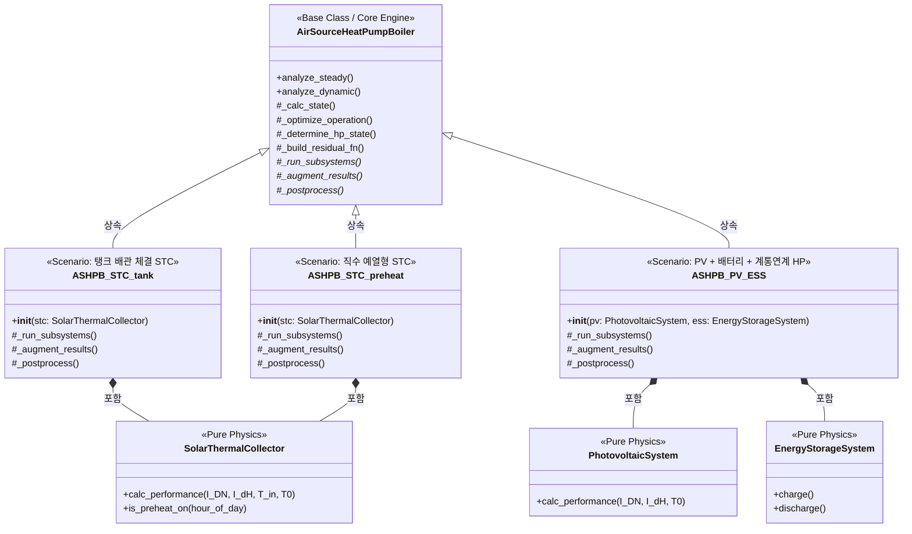

# ASHPB 핵심 아키텍처 및 클래스 관계도 (src/enex_analysis)

본 문서는 `AirSourceHeatPumpBoiler` 부모 클래스를 중심으로 파생된 다양한 히트펌프 서브시스템 시나리오, 그리고 물리 계산을 담당하는 순수 물리 엔진 간의 구조적 관계를 설명합니다.

---

## 1. 아키텍처 개요: 템플릿 메서드 패턴 (Template Method) + 합성 (Composition)

현재 히트펌프 해석 모듈은 코어 엔진과 서브시스템을 효과적으로 분리하기 위해 **템플릿 메서드 패턴**과 **합성**을 사용하고 있습니다. 

1. **상속 (Inheritance) - 템플릿 메서드 제공**: 
   `AirSourceHeatPumpBoiler`는 열역학 및 시스템 방정식의 핵심 풀이(Solver) 로직을 모두 내장하고 있습니다. 그리고 자식 클래스가 확장할 수 있는 여러 **"Hook 메서드"**(예: `_run_subsystems()`, `_augment_results()`, `_postprocess()`)를 추상화하여 제공합니다.
2. **합성 (Composition) - 순수 물리 엔진 주입**: 
   태양열(STC)이나 태양광(PV), 배터리(ESS) 모듈들은 철저하게 상태를 가지지 않는 **순수 물리 계산기(Pure Physics Engine)**입니다. 시스템의 시나리오를 구성하는 자식 클래스들은 이러한 물리 연산 객체를 외부에서 주입(Dependency Injection) 받아 내부에서 활용합니다.

이러한 설계의 최대 장점은 **복잡한 수치해석 Solver 코드(`AirSourceHeatPumpBoiler`)를 건드리지 않고도 새로운 물리 구성을 갖는 장치 시나리오를 무한히 확장할 수 있다**는 점입니다.

---

## 2. 클래스 다이어그램 (Mermaid)

---

## 3. 계층별 상세 설명

### [계층 A] 코어 엔진 (`air_source_heat_pump_boiler.py`)
- **`AirSourceHeatPumpBoiler`** 클래스
- **역할**: 열역학 핵심 엔진. CoolProp을 이용한 냉매 증기압축 사이클 해석과 축열조의 상태를 풀이하는 Solver 역할을 전담합니다.
- **특징**: `_build_residual_fn` 등을 통해 Solver를 통제하지만, `_run_subsystems()`, `_augment_results()` 같은 시그니처만 남겨두고 서브시스템이 알아서 결과를 집어넣도록 위임합니다.

### [계층 B] 순수 물리 엔진 (`subsystems.py`)
- **`SolarThermalCollector`, `PhotovoltaicSystem`, `EnergyStorageSystem`** 클래스
- **역할**: 시간이나 시스템 스케줄에 전혀 관여하지 않는, 순수한 수학/물리학 방정식의 래퍼(Wrapper) 묶음입니다.
- **특징**:
  - **상태를 갖지 않음 (Stateless)**: 이전 시간의 온도나 펌프의 작동 여부를 보관하지 않습니다. 단지 입력을 주면 결과를 출력(`calc_performance`)할 뿐입니다.
  - 시간이나 반복문 루프에 의존성이 없어 **단위 테스트(Unit Test)를 작성하기에 매우 적합**한 구조를 갖추고 있습니다.

### [계층 C] 시나리오 구성 (Glue Classes) (`ashpb_*.py`)
- **`ASHPB_STC_tank`, `ASHPB_STC_preheat`, `ASHPB_PV_ESS`** 클래스
- **역할**: 코어 엔진과 순수 물리 엔진을 이어주는 **"배관공" (Glue)** 역할을 수행합니다.
- **특징**:
  - `__init__`을 통해 물리 엔진 인스턴스를 외부에서 주입받습니다.
  - **배관 로직 구현**: 엔진의 루프 도중 실행되는 `_run_subsystems()` 와 `_augment_results()` 내에서 물리 엔진을 콜(Call) 한 뒤, 나온 결과(열량, 전력 등)를 메인 데이터프레임 구조나 히트펌프의 부하(Load)로 매핑합니다. 
  - 예를 들어 `ASHPB_PV_ESS` 클래스의 `_augment_results()`는 PV에서 만든 전기를 가져와 HP가 사용할 만큼 소모하고 남은 것을 ESS 충전 메서드(`ess.charge()`)로 보내는 등 **에너지 라우팅 제어(Energy Routing)**를 담당합니다.
