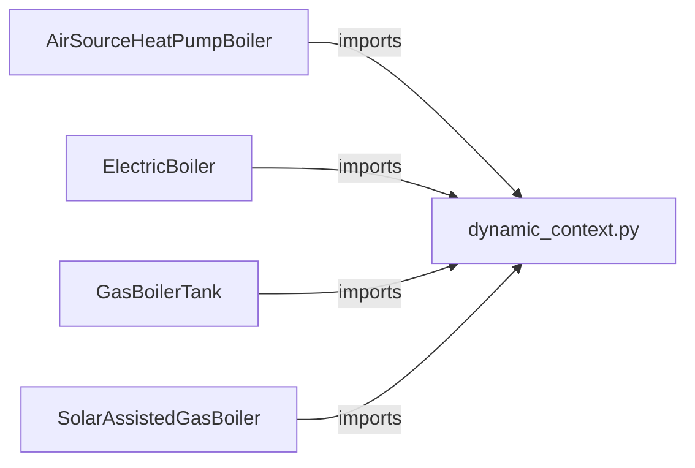

# Dynamic Context — Shared Simulation Infrastructure

> Module: `enex_analysis.dynamic_context`

## Overview

Provides reusable dataclasses and pure functions that form the backbone of
time-stepping boiler simulations. Extracted from `AirSourceHeatPumpBoiler`
so that all tank-based dynamic models (`ElectricBoiler`, `GasBoilerTank`,
`SolarAssistedGasBoiler`, and future models) share the same infrastructure.

## Architecture



## Dataclasses

### `StepContext`

Per-timestep immutable context passed through all Phase-A/B/C functions.

| Attribute | Type | Description |
|---|---|---|
| `n` | `int` | Current step index |
| `current_time_s` | `float` | Elapsed simulation time [s] |
| `current_hour` | `float` | Elapsed simulation time [h] |
| `hour_of_day` | `float` | Hour within day (0–24, repeating) |
| `T0` | `float` | Dead-state / outdoor-air temperature [°C] |
| `T0_K` | `float` | Dead-state temperature [K] |
| `preheat_on` | `bool` | Whether the preheat window is active |
| `T_tank_w_K` | `float` | Current tank water temperature [K] |
| `tank_level` | `float` | Fractional tank fill level (0–1) |
| `dV_mix_w_out` | `float` | Service water draw-off flow rate [m³/s] |
| `I_DN` | `float` | Direct-normal irradiance [W/m²] (default 0.0) |
| `I_dH` | `float` | Diffuse-horizontal irradiance [W/m²] (default 0.0) |
| `T_sup_w_K` | `float` | Mains water supply temperature [K] (default 288.15) |

### `ControlState`

Model-agnostic control decisions produced during Phase A.

| Attribute | Type | Description |
|---|---|---|
| `is_on` | `bool` | Whether the heat source is running |
| `Q_heat_source` | `float` | Net heat delivered to the tank [W] |
| `dV_tank_w_in_ctrl` | `float \| None` | Refill flow [m³/s]; `None` = always-full |
| `result` | `dict` | Full result from `_calc_state` (model-specific) |

*Note: Subsystem states (e.g., STC) are managed separately via `sub_states` dictionaries, following the `Subsystem` protocol.*

### `SubsystemExergy`

Frozen dataclass returned by each subsystem's `calc_exergy()` to let the host boiler merge exergy columns and adjust system-level totals.

| Attribute | Type | Description |
|---|---|---|
| `columns` | `dict[str, pd.Series]` | Exergy columns to append |
| `X_tot_add` | `pd.Series \| float` | Additive contribution to system total exergy input |
| `X_in_tank_add` | `pd.Series \| float` | Additive exergy entering the tank boundary |
| `X_out_tank_add` | `pd.Series \| float` | Additive exergy leaving the tank boundary |

### `Subsystem` Protocol

Pluggable subsystem interface. Each subsystem computes its contribution for a single timestep and assembles result columns for the output DataFrame. New subsystems implement this protocol and register with the boiler model.

| Method | Signature | Description |
|---|---|---|
| `step(...)` | `(ctx, ctrl, dt, T_tank_w_in_K) → dict` | Compute subsystem state; returns `Q_contribution`, `E_subsystem`, `T_tank_w_in_override_K` |
| `assemble_results(...)` | `(ctx, ctrl, step_state, T_solved_K) → dict` | Build result columns for DataFrame output |
| `calc_exergy(...)` | `(df, T0_K) → SubsystemExergy \| None` | Compute subsystem-level exergy columns for post-processing |

## Pure Functions

### `determine_heat_source_on_off()`

Hysteresis-based heat-source on/off decision. Used by all tank-based models.

```python
from enex_analysis.dynamic_context import determine_heat_source_on_off

is_on = determine_heat_source_on_off(
    T_tank_w_C=55.0,
    T_lower=50.0,
    T_upper=60.0,
    is_on_prev=True,
    hour_of_day=14.0,
    on_schedule=[(0.0, 24.0)],
)
```

### `determine_tank_refill_flow()`

Tank water level management logic. Returns `(dV_tank_w_in, is_refilling)`.
When `dV_tank_w_in` is `None`, the tank is in always-full mode (inflow = outflow).

### `tank_mass_energy_residual()`

Coupled energy/mass balance residuals for Newton-Raphson solver (`fsolve`).
The 3-way mixing valve ratio α(T) makes the system nonlinear in T^{n+1}.
Supports subsystem energy contributions and tank-inlet temperature overrides.

## References

- Used by: `AirSourceHeatPumpBoiler`, `ElectricBoiler`, `GasBoilerTank`, `SolarAssistedGasBoiler`
- Depends on: `enex_functions` (mixing valve, UV lamp, HP schedule utilities), `subsystems` (Subsystem protocol)
