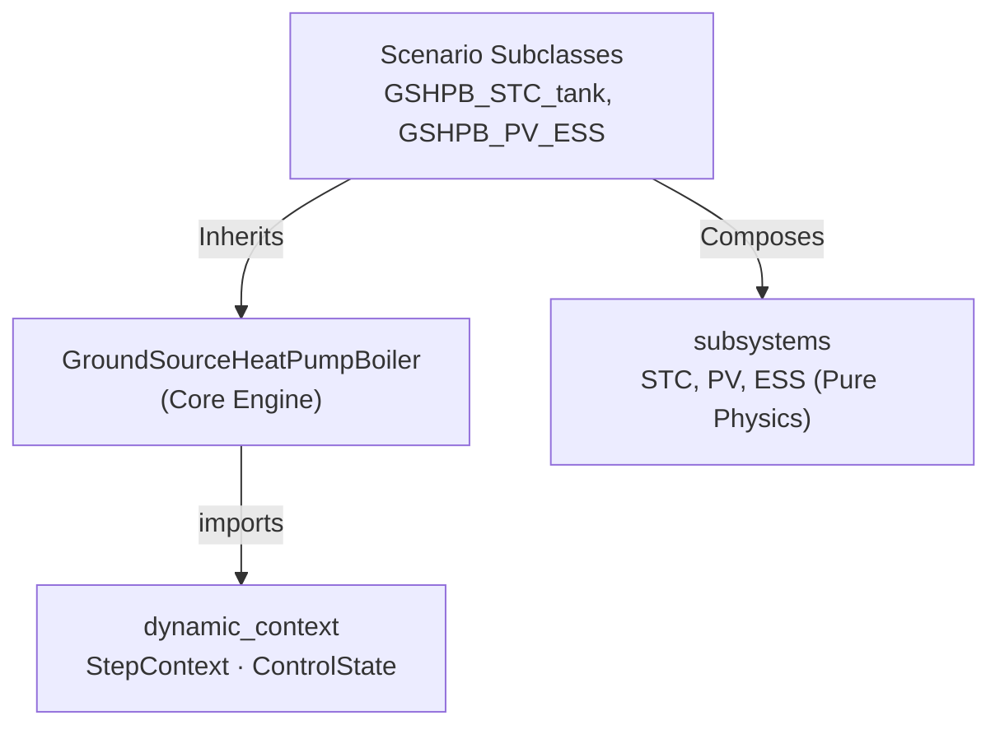

# Ground Source Heat Pump Boiler (GSHPB)

> Module: `enex_analysis.GroundSourceHeatPumpBoiler`

## Overview

Physics-based ground source heat pump boiler model with borehole heat exchanger,
refrigerant cycle resolution via CoolProp, and UV disinfection support. The
evaporator uses ground-loop water instead of outdoor air, providing stable
source temperatures year-round. The optimiser uses Differential Evolution
(SLSQP fallback) to minimise total power, and the condenser LMTD constraint
is enforced via a penalty function.

## System Architecture

```
  Ground Loop ──→ Evaporator (HX) ──→ Compressor ──→ Condenser (HX) ──→ Tank
       ↑                                                                    │
       └────────────────── Borehole Heat Exchanger ◄────────────────────────┘

  Subsystem Integration (via Scenario Subclasses):
    GSHPB_STC_tank, GSHPB_STC_preheat → SolarThermalCollector integration
    GSHPB_PV_ESS → PhotovoltaicSystem + EnergyStorageSystem
```

## Modular Structure (Phase 3)

The model uses a **Template Method** supplemented by **composition-based** architecture, matching the ASHPB implementation:



The storage tank temperature is updated using a **fully implicit** scheme (`scipy.optimize.fsolve`), solving coupled energy and mass balance residuals at each timestep.

## Key Parameters

### Refrigerant / Cycle

| Parameter | Default | Unit | Description |
|---|---|---|---|
| `refrigerant` | `'R410A'` | — | Refrigerant type |
| `V_disp_cmp` | 0.0005 | m³ | Compressor displacement |
| `eta_cmp_isen` | 0.7 | — | Isentropic efficiency |
| `dT_superheat` | 3.0 | K | Superheat |
| `dT_subcool` | 3.0 | K | Subcool |

### Ground Loop / Borehole

| Parameter | Default | Unit | Description |
|---|---|---|---|
| `T_b_f_in` | 15.0 | °C | Borehole fluid inlet temperature |
| `UA_evap_design` | 3000.0 | W/K | Evaporator design UA |

### Subsystems (Scenario-based injection)

While the base class supports `uv_lamp` features, solar integration utilizes scenario subclasses:

| Scenario Class | Injected Parameters | Description |
|---|---|---|
| `GSHPB_STC_tank` | `stc: SolarThermalCollector` | STC circulated to/from the storage tank. |
| `GSHPB_STC_preheat` | `stc: SolarThermalCollector` | STC preheats incoming mains water. |
| `GSHPB_PV_ESS` | `pv: PhotovoltaicSystem, ess: EnergyStorageSystem` | HP powered by PV with Battery and Grid routing. |

## Usage

### Steady-State Analysis

```python
from enex_analysis import GroundSourceHeatPumpBoiler

gshp = GroundSourceHeatPumpBoiler(
    refrigerant='R410A',
    V_disp_cmp=0.0005,
)

result = gshp.analyze_steady(
    T_tank_w=55.0,
    T_b_f_in=15.0,
    Q_cond_load=8000,
    T0=5.0,
)

print(f"COP: {result['cop_sys']:.2f}")
```

### Dynamic Simulation (without Subsystems)

```python
import numpy as np

dt_s = 60
tN = len(np.arange(0, 86400, dt_s))
T0_schedule = np.full(tN, 5.0)

df = gshp.analyze_dynamic(
    simulation_period_sec=86400,
    dt_s=dt_s,
    T_tank_w_init_C=20.0,
    dhw_usage_schedule=[("7:00", "8:00", 1.0)],
    T0_schedule=T0_schedule,
)
```

### Dynamic Simulation with STC (Scenario Subclass)

```python
from enex_analysis.subsystems import SolarThermalCollector
from enex_analysis.gshpb_stc_tank import GSHPB_STC_tank

stc = SolarThermalCollector(A_stc=4.0)

hp_stc = GSHPB_STC_tank(
    stc=stc, 
    refrigerant='R410A',
    hp_capacity=10000.0,
)

df = hp_stc.analyze_dynamic(
    ...,
    I_DN_schedule=I_DN_array,
    I_dH_schedule=I_dH_array,
)
```

## API Reference

| Method | Description |
|---|---|
| `analyze_steady(T_tank_w, T_b_f_in, ...)` | Single operating point analysis |
| `analyze_dynamic(...)` | Dynamic simulation with tank and BHE g-function |

### Internal Methods

| Method | Description |
|---|---|
| `_calc_state(optimization_vars, T_tank_w, Q_cond_load, T0)` | Evaluate refrigerant cycle |
| `_calc_off_state(T_tank_w, T0)` | Zero-load result dict for OFF state |
| `_optimize_operation(T_tank_w, Q_cond_load, T0)` | Differential Evolution minimisation |

## References

- CoolProp library for refrigerant properties
- Finite Line Source (FLS) g-function model
