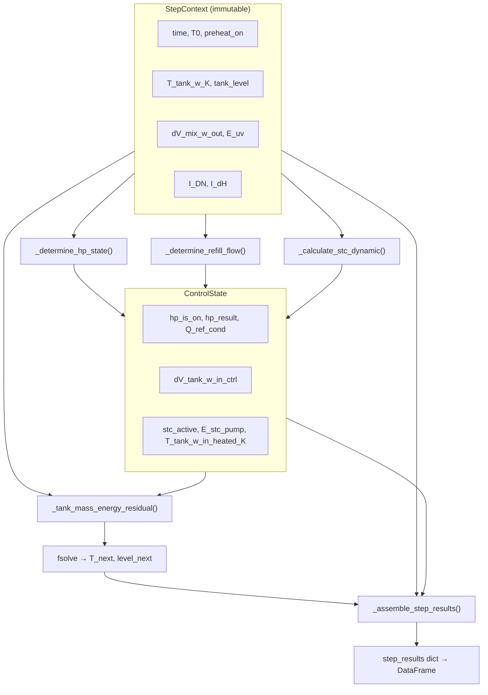
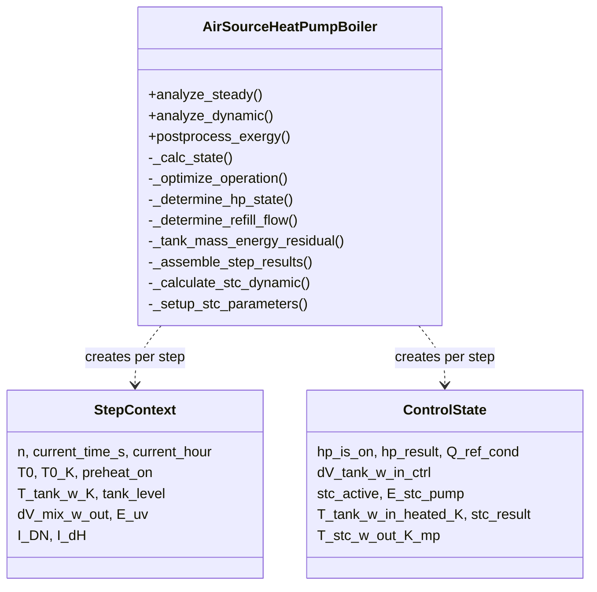

# Air Source Heat Pump Boiler (ASHPB)

> Module: `enex_analysis.AirSourceHeatPumpBoiler`

## Overview

Physics-based air source heat pump boiler model with refrigerant cycle resolution,
dynamic tank simulation, and optional solar thermal collector (STC) integration.
The model finds the optimal evaporator approach temperature at each time step by
minimizing total electrical power (`E_cmp + E_ou_fan`) via Brent's bounded 1-D method
(`scipy.optimize.minimize_scalar`).

The storage tank temperature is updated using a **fully implicit** scheme
(`scipy.optimize.fsolve`), solving coupled energy and mass balance residuals
at each timestep for unconditional stability.

## System Architecture

```
                ┌─────────────────────┐
  Outdoor Air → │  Evaporator (HX)    │ ← Refrigerant
                └─────────┬───────────┘
                          │
                ┌─────────▼───────────┐
                │  Compressor (VSD)   │  ← Optimization variable: dT_ref_evap
                └─────────┬───────────┘
                          │
                ┌─────────▼───────────┐
                │  Condenser (HX)     │ → Hot water to Tank
                └─────────┬───────────┘
                          │
                ┌─────────▼───────────┐
                │  Expansion Valve    │
                └─────────────────────┘

  Optional:  Solar Thermal Collector → Tank (preheat or circuit mode)
```

## Code Structure

### Data Flow — `analyze_dynamic` per-timestep



### Class Method Overview



### Implicit Solver — Why `fsolve`?

The 3-way mixing valve ratio `α(T) = (T_mix − T_in) / (T − T_in)` makes the
tank outflow a **nonlinear function** of `T^{n+1}`. This couples the energy
balance into a 2×2 nonlinear system `[r_energy, r_mass] = 0`, solved by
Newton-Raphson (`fsolve`).

> If α were frozen at time n, the energy residual becomes linear in T and
> admits a direct algebraic solution without iteration.

## Key Parameters

### Refrigerant / Cycle / Compressor

| Parameter | Default | Unit | Description |
|---|---|---|---|
| `ref` | `'R134a'` | — | Refrigerant type (CoolProp string) |
| `V_disp_cmp` | 0.0002 | m³ | Compressor displacement volume |
| `eta_cmp_isen` | 0.8 | — | Isentropic efficiency |
| `dT_superheat` | 3.0 | K | Evaporator outlet superheat |
| `dT_subcool` | 3.0 | K | Condenser outlet subcool |
| `hp_capacity` | 15000.0 | W | HP rated heating capacity |

### Heat Exchanger

| Parameter | Default | Unit | Description |
|---|---|---|---|
| `UA_cond_design` | 2000.0 | W/K | Condenser design UA |
| `UA_evap_design` | 1000.0 | W/K | Evaporator design UA |
| `A_cross_ou` | π×0.25² | m² | Outdoor unit cross-section area |

### Outdoor Unit Fan

| Parameter | Default | Unit | Description |
|---|---|---|---|
| `dV_ou_fan_a_design` | 1.5 | m³/s | Design airflow rate |
| `dP_ou_fan_design` | 90.0 | Pa | Design static pressure |
| `eta_ou_fan_design` | 0.6 | — | Design fan efficiency |

### Storage Tank / Control / Load

| Parameter | Default | Unit | Description |
|---|---|---|---|
| `r0` | 0.2 | m | Tank inner radius |
| `H` | 1.2 | m | Tank height |
| `x_shell` | 0.005 | m | Shell thickness |
| `x_ins` | 0.05 | m | Insulation thickness |
| `k_shell` | 25 | W/(m·K) | Shell conductivity |
| `k_ins` | 0.03 | W/(m·K) | Insulation conductivity |
| `h_o` | 15 | W/(m²·K) | External convective coefficient |
| `T_tank_w_upper_bound` | 65.0 | °C | Tank upper setpoint |
| `T_tank_w_lower_bound` | 60.0 | °C | Tank lower setpoint |
| `T_mix_w_out` | 40.0 | °C | Service water delivery temperature |
| `T_tank_w_in` | 15.0 | °C | Mains water supply temperature |
| `dV_mix_w_out_max` | 0.0045 | m³/s | Max service flow rate |

### Tank Water Level Management

| Parameter | Default | Unit | Description |
|---|---|---|---|
| `tank_always_full` | `True` | — | Keep tank at full level |
| `tank_level_lower_bound` | 0.5 | — | Tank level lower bound |
| `tank_level_upper_bound` | 1.0 | — | Tank level upper bound |
| `dV_tank_w_in_refill` | 0.001 | m³/s | Refill flow rate |
| `prevent_simultaneous_flow` | `False` | — | Prevent draw-off during refill |

### UV Lamp

| Parameter | Default | Unit | Description |
|---|---|---|---|
| `lamp_power_watts` | 0 | W | UV lamp power (0 = disabled) |
| `uv_lamp_exposure_duration_min` | 0 | min | UV exposure per cycle |
| `num_switching_per_3hour` | 1 | — | Switching count per 3 h |

### HP Operating Schedule

| Parameter | Default | Unit | Description |
|---|---|---|---|
| `hp_on_schedule` | `[(0.0, 24.0)]` | — | Active operating windows (start_h, end_h) |

### Solar Thermal Collector (STC)

| Parameter | Default | Unit | Description |
|---|---|---|---|
| `A_stc` | 0.0 | m² | Collector area (0 = disabled) |
| `stc_tilt` | 35.0 | ° | Collector tilt from horizontal |
| `stc_azimuth` | 180.0 | ° | Collector azimuth (180 = south) |
| `stc_placement` | `'tank_circuit'` | — | `'tank_circuit'` or `'mains_preheat'` |
| `dV_stc_w` | 0.001 | m³/s | STC loop flow rate |
| `E_stc_pump` | 50.0 | W | STC pump power |
| `preheat_start_hour` | 6 | h | Preheat window start |
| `preheat_end_hour` | 18 | h | Preheat window end |

### VSD Fan Coefficients

| Parameter | Default | Description |
|---|---|---|
| `vsd_coeffs_ou` | ASHRAE 90.1-2022 | `c1=0.0013, c2=0.1470, c3=0.9506, c4=−0.0998, c5=0.0` |

## Usage

### Steady-State Analysis

```python
from enex_analysis import AirSourceHeatPumpBoiler

hp = AirSourceHeatPumpBoiler(
    ref='R134a',
    V_disp_cmp=0.0002,
    UA_cond_design=2000.0,
    UA_evap_design=1000.0,
)

result = hp.analyze_steady(
    T_tank_w=55.0,       # Tank water temperature [°C]
    T0=5.0,              # Outdoor air temperature [°C]
    Q_cond_target=5000,  # Target heat rate [W]
)

print(f"Compressor power: {result['E_cmp [W]']:.1f} W")
print(f"Total power: {result['E_tot [W]']:.1f} W")
```

### Dynamic Simulation

```python
import numpy as np

schedule_entries = [
    ("7:00", "8:00",  1.0),     # Morning peak
    ("12:00", "13:00", 0.5),    # Midday
    ("19:00", "21:00", 1.0),    # Evening peak
]

# T0_schedule must be a per-timestep array (length = tN)
dt_s = 60
simulation_period_sec = 86400
tN = len(np.arange(0, simulation_period_sec, dt_s))
T0_schedule = np.full(tN, 5.0)  # Constant 5 °C outdoor air

result_df = hp.analyze_dynamic(
    simulation_period_sec=simulation_period_sec,
    dt_s=dt_s,
    T_tank_w_init_C=20.0,
    schedule_entries=schedule_entries,
    T0_schedule=T0_schedule,
    result_save_csv_path='result.csv',
)
```

### Dynamic Simulation with STC

```python
hp_stc = AirSourceHeatPumpBoiler(
    A_stc=4.0,
    stc_placement='tank_circuit',
    stc_tilt=35.0,
    stc_azimuth=180.0,
)

result_df = hp_stc.analyze_dynamic(
    simulation_period_sec=simulation_period_sec,
    dt_s=dt_s,
    T_tank_w_init_C=20.0,
    schedule_entries=schedule_entries,
    T0_schedule=T0_schedule,
    I_DN_schedule=I_DN_array,   # Direct-normal irradiance [W/m²]
    I_dH_schedule=I_dH_array,   # Diffuse-horizontal irradiance [W/m²]
)
```

### Exergy Post-Processing

```python
df_ex = hp.postprocess_exergy(result_df)
print(f"Total exergy consumption: {df_ex['Xc_tot [W]'].sum():.0f} W")
```

## API Reference

| Method | Description |
|---|---|
| `analyze_steady(T_tank_w, T0, ...)` | Single operating point analysis |
| `analyze_dynamic(...)` | Time-stepping dynamic simulation (fully implicit) |
| `postprocess_exergy(df)` | Add exergy columns to result DataFrame |
| `_calc_state(dT_ref_evap, T_tank_w, Q_cond_target, T0)` | Evaluate refrigerant cycle at a given operating point |
| `_optimize_operation(T_tank_w, Q_cond_target, T0)` | Brent 1-D minimization of `E_tot` over `dT_ref_evap` |
| `_determine_hp_state(ctx, hp_is_on_prev)` | HP hysteresis + cycle optimisation |
| `_determine_refill_flow(ctx, is_refilling, use_stc)` | Refill control decision |
| `_tank_mass_energy_residual(x, ctx, ctrl, dt, ...)` | Energy / mass balance residuals for fsolve |
| `_assemble_step_results(ctx, ctrl, T_solved_K, ...)` | Post-solve reporting dict assembly |
| `_calculate_stc_dynamic(I_DN, I_dH, T_tank_w_K, ...)` | STC probe & performance (both placements) |
| `_setup_stc_parameters(...)` | Initialise STC parameters (called from `__init__`) |

## References

- ASHRAE Standard 90.1-2022 (VSD fan power curves)
- CoolProp library for refrigerant properties
