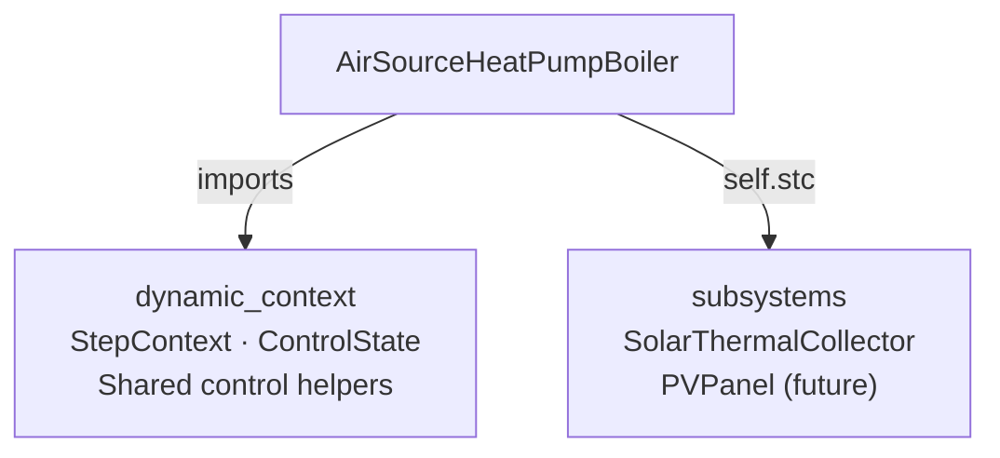
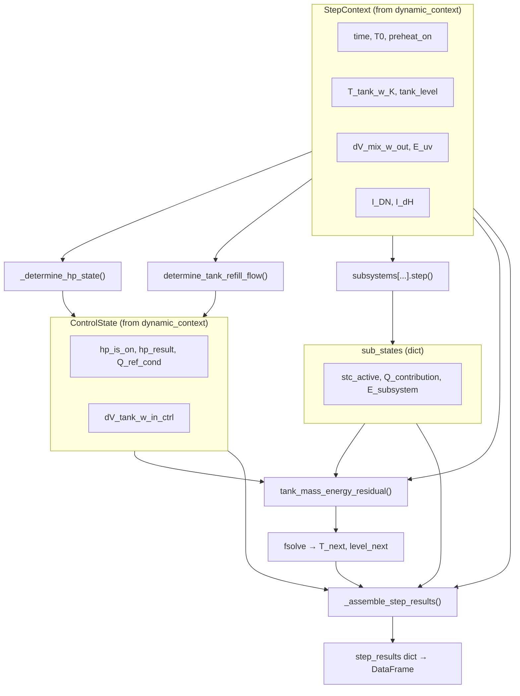

# Air Source Heat Pump Boiler (ASHPB)

> Module: `enex_analysis.AirSourceHeatPumpBoiler`

## Overview

Physics-based air source heat pump boiler model with refrigerant cycle resolution,
dynamic tank simulation, and optional subsystem integration via class-based injection.
The model finds the optimal evaporator approach temperature at each time step by
minimizing total electrical power (`E_cmp + E_ou_fan`) via Brent's bounded 1-D method
(`scipy.optimize.minimize_scalar`).

The storage tank temperature is updated using a **fully implicit** scheme
(`scipy.optimize.fsolve`), solving coupled energy and mass balance residuals
at each timestep for unconditional stability.

## System Architecture

```
                ┌─────────────────────┐
  Outdoor Air → │  Evaporator (HX)    │ ← Refrigerant
                └─────────┬───────────┘
                          │
                ┌─────────▼───────────┐
                │  Compressor (VSD)   │  ← Optimisation: dT_ref_evap
                └─────────┬───────────┘
                          │
                ┌─────────▼───────────┐
                │  Condenser (HX)     │ → Hot water to Tank
                └─────────┬───────────┘
                          │
                ┌─────────▼───────────┐
                │  Expansion Valve    │
                └─────────────────────┘

  Optional subsystems (class-based injection):
    SolarThermalCollector → Tank (preheat or circuit mode)
    PVPanel → (future)
```

## Modular Structure (v2)

The model uses **composition-based** architecture:



| Module | Responsibility |
|---|---|
| `dynamic_context` | `StepContext`, `ControlState`, HP hysteresis, tank level, residual solver |
| `subsystems` | `SolarThermalCollector` class (config + methods), future `PVPanel` |
| `AirSourceHeatPumpBoiler` | ASHP-specific physics, optimisation, simulation loop |

### Data Flow — `analyze_dynamic` per-timestep



`SolarThermalCollector`가 mains-preheat 모드로 동작할 때 집열기 출구 온도는 항상
**가열된 저탕조 유입수 온도**인 `T_tank_w_in_heated_K`로 전달되며, 관련 문서와
코드에서는 이 이름으로 통일한다.

## Key Parameters

### Refrigerant / Cycle / Compressor

| Parameter | Default | Unit | Description |
|---|---|---|---|
| `ref` | `'R134a'` | — | Refrigerant type (CoolProp string) |
| `V_disp_cmp` | 0.0002 | m³ | Compressor displacement volume |
| `eta_cmp_isen` | 0.8 | — | Isentropic efficiency |
| `dT_superheat` | 3.0 | K | Evaporator outlet superheat |
| `dT_subcool` | 3.0 | K | Condenser outlet subcool |
| `hp_capacity` | 15000.0 | W | HP rated heating capacity |

### Heat Exchanger

| Parameter | Default | Unit | Description |
|---|---|---|---|
| `UA_cond_design` | 2000.0 | W/K | Condenser design UA |
| `UA_evap_design` | 1000.0 | W/K | Evaporator design UA |
| `A_cross_ou` | π×0.25² | m² | Outdoor unit cross-section area |

### Outdoor Unit Fan

| Parameter | Default | Unit | Description |
|---|---|---|---|
| `dV_ou_fan_a_design` | 1.5 | m³/s | Design airflow rate |
| `dP_ou_fan_design` | 90.0 | Pa | Design static pressure |
| `eta_ou_fan_design` | 0.6 | — | Design fan efficiency |

### Storage Tank / Control / Load

| Parameter | Default | Unit | Description |
|---|---|---|---|
| `r0` | 0.2 | m | Tank inner radius |
| `H` | 1.2 | m | Tank height |
| `T_tank_w_upper_bound` | 65.0 | °C | Tank upper setpoint |
| `T_tank_w_lower_bound` | 60.0 | °C | Tank lower setpoint |
| `T_mix_w_out` | 40.0 | °C | Service water delivery temperature |
| `T_tank_w_in` | 15.0 | °C | Mains water supply temperature |
| `dV_mix_w_out_max` | 0.0045 | m³/s | Max service flow rate |

### Subsystems (class-based injection)

| Parameter | Type | Description |
|---|---|---|
| `stc` | `SolarThermalCollector \| None` | Solar thermal collector (see `subsystems` guide) |

## Usage

### Steady-State Analysis

```python
from enex_analysis import AirSourceHeatPumpBoiler

hp = AirSourceHeatPumpBoiler(
    ref='R134a',
    UA_cond_design=2000.0,
    UA_evap_design=1000.0,
)

result = hp.analyze_steady(
    T_tank_w=55.0,
    T0=5.0,
    Q_cond_target=5000,
)

print(f"Total power: {result['E_tot [W]']:.1f} W")
```

### Dynamic Simulation (without STC)

```python
import numpy as np

dt_s = 60
tN = len(np.arange(0, 86400, dt_s))
T0_schedule = np.full(tN, 5.0)

schedule = [("7:00", "8:00", 1.0), ("19:00", "21:00", 1.0)]

df = hp.analyze_dynamic(
    simulation_period_sec=86400,
    dt_s=dt_s,
    T_tank_w_init_C=20.0,
    dhw_usage_schedule=schedule,
    T0_schedule=T0_schedule,
)
```

### Dynamic Simulation with STC (class injection)

```python
from enex_analysis.subsystems import SolarThermalCollector

stc = SolarThermalCollector(
    A_stc=4.0,
    mode='tank_circuit',
    stc_tilt=35.0,
    stc_azimuth=180.0,
)

hp_stc = AirSourceHeatPumpBoiler(..., stc=stc)

df = hp_stc.analyze_dynamic(
    ...,
    I_DN_schedule=I_DN_array,
    I_dH_schedule=I_dH_array,
)
```

### Exergy Post-Processing

```python
df_ex = hp.postprocess_exergy(result_df)
```

## API Reference

| Method | Description |
|---|---|
| `analyze_steady(T_tank_w, T0, ...)` | Single operating point analysis |
| `analyze_dynamic(...)` | Time-stepping dynamic simulation (fully implicit) |
| `postprocess_exergy(df)` | Add exergy columns to result DataFrame |

### Internal Methods (ASHP-specific)

| Method | Description |
|---|---|
| `_calc_state(...)` | Evaluate refrigerant cycle at a given operating point |
| `_optimize_operation(...)` | Brent 1-D minimisation of `E_tot` |
| `_determine_hp_state(ctx, ...)` | HP hysteresis + cycle optimisation |
| `_assemble_step_results(...)` | Post-solve reporting dict assembly |

### Shared Functions (from `dynamic_context`)

| Function | Description |
|---|---|
| `determine_hp_on_off(...)` | Pure hysteresis logic |
| `determine_tank_refill_flow(...)` | Tank level management |
| `tank_mass_energy_residual(...)` | Energy/mass balance residuals for `fsolve` |

## References

- ASHRAE Standard 90.1-2022 (VSD fan power curves)
- CoolProp library for refrigerant properties
- See also: [dynamic_context guide](dynamic_context.md), [subsystems guide](subsystems.md)
