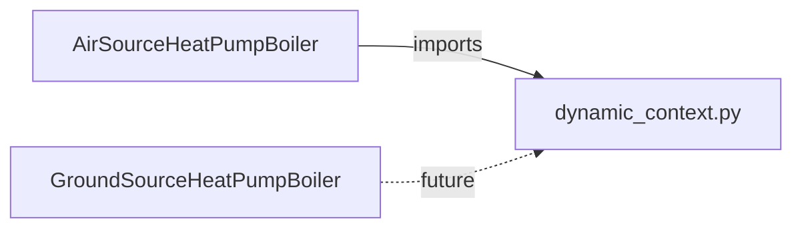

# Dynamic Context — Shared Simulation Infrastructure

> Module: `enex_analysis.dynamic_context`

## Overview

Provides reusable dataclasses and pure functions that form the backbone of
time-stepping heat-pump simulations.  Extracted from `AirSourceHeatPumpBoiler`
so that `GroundSourceHeatPumpBoiler` and future models can share the same
infrastructure without code duplication.

## Architecture



## Dataclasses

### `StepContext`

Per-timestep immutable context passed through all Phase-A/B/C functions.

| Attribute | Type | Description |
|---|---|---|
| `n` | `int` | Current step index |
| `current_time_s` | `float` | Elapsed simulation time [s] |
| `current_hour` | `float` | Elapsed simulation time [h] |
| `hour_of_day` | `float` | Hour within day (0–24, repeating) |
| `T0` | `float` | Dead-state / outdoor-air temperature [°C] |
| `T0_K` | `float` | Dead-state temperature [K] |
| `preheat_on` | `bool` | Whether the preheat window is active |
| `T_tank_w_K` | `float` | Current tank water temperature [K] |
| `tank_level` | `float` | Fractional tank fill level (0–1) |
| `dV_mix_w_out` | `float` | Service water draw-off flow rate [m³/s] |
| `E_uv` | `float` | Instantaneous UV lamp power [W] |
| `I_DN` | `float` | Direct-normal irradiance [W/m²] |
| `I_dH` | `float` | Diffuse-horizontal irradiance [W/m²] |

### `ControlState`

Control decisions and HP cycle results produced during Phase A.

| Attribute | Type | Description |
|---|---|---|
| `hp_is_on` | `bool` | Whether the heat pump is running |
| `hp_result` | `dict` | Full cycle result from `_calc_state` |
| `Q_ref_cond` | `float` | Condenser heat rate [W] |
| `dV_tank_w_in_ctrl` | `float \| None` | Refill flow [m³/s]; `None` = always-full |
| `stc_active` | `bool` | STC subsystem active flag |
| `E_stc_pump` | `float` | STC pump power [W] |
| `T_tank_w_in_heated_K` | `float` | Tank inlet after STC preheat [K] |
| `stc_result` | `dict` | STC performance result |
| `T_stc_w_out_K_mp` | `float` | STC water outlet for mains-preheat [K] |

## Pure Functions

### `determine_hp_on_off()`

Hysteresis-based heat-pump on/off decision.

```python
from enex_analysis.dynamic_context import determine_hp_on_off

hp_on = determine_hp_on_off(
    T_tank_w_C=55.0,
    T_lower=50.0,
    T_upper=60.0,
    hp_is_on_prev=True,
    hour_of_day=14.0,
    hp_on_schedule=[(0.0, 24.0)],
)
```

### `determine_refill_flow()`

Tank water level management logic.  Returns `(dV_tank_w_in, is_refilling)`.
When `dV_tank_w_in` is `None`, the tank is in always-full mode (inflow = outflow).

### `tank_mass_energy_residual()`

Coupled energy/mass balance residuals for Newton-Raphson solver (`fsolve`).
The 3-way mixing valve ratio α(T) makes the system nonlinear in T^{n+1}.

## References

- Used by: `AirSourceHeatPumpBoiler.analyze_dynamic()`
- Depends on: `enex_functions` (mixing valve, UV lamp, HP schedule utilities)
