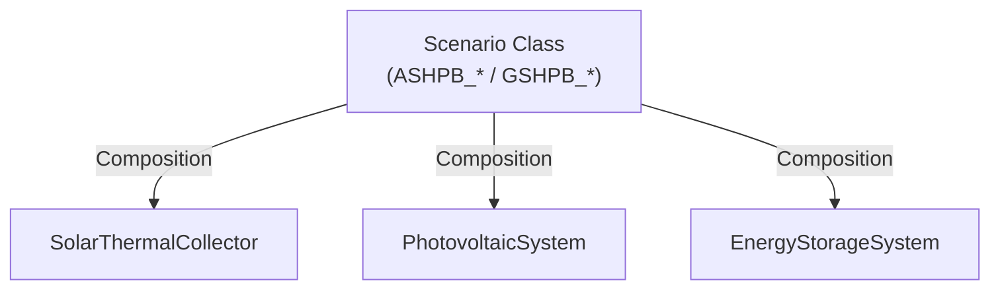

# Subsystems — Attachable Equipment Modules

> Module: `enex_analysis.subsystems`

## Overview

Provides self-contained subsystem classes that serve as **pure physics engines**. 
Each subsystem bundles its physical parameters with methods that calculate
thermal or electrical performance based on specific environmental inputs.
These engines are **stateless**; they do not retain simulation timeline information. 
Instead, they are composed via constructor injection into specific **Scenario Classes** (e.g., `ASHPB_STC_tank`, `GSHPB_PV_ESS`) which handle simulation orchestration, activation scheduling, and result assembly.

```python
# Example: attach STC to a specific Scenario Class
from enex_analysis.subsystems import SolarThermalCollector
from enex_analysis.gshpb_stc_tank import GSHPB_STC_tank

stc = SolarThermalCollector(A_stc=4.0)
hp = GSHPB_STC_tank(..., stc=stc)
```

## Architecture



### Extension Pattern (Phase 3)

To add a new subsystem:

1. Create a `dataclass` in `subsystems.py` to hold physical state variables and parameters.
2. Implement pure physical calculators (e.g., `calc_performance`) that return a dictionary of generated/consumed heat or power.
3. Keep the module stateless. Move time-step orchestration or state routing to a specific **Scenario class** (e.g., inheriting from `AirSourceHeatPumpBoiler` or `GroundSourceHeatPumpBoiler`) to manage the hooks (`_run_subsystems()`, `_augment_results()`, and `_postprocess()`).

---

## `SolarThermalCollector`

Flat-plate or evacuated-tube solar thermal collector with two placement modes.

### Parameters

| Parameter | Default | Unit | Description |
|---|---|---|---|
| `A_stc` | 2.0 | m² | Collector gross area |
| `stc_tilt` | 35.0 | ° | Tilt from horizontal |
| `stc_azimuth` | 180.0 | ° | Azimuth (180 = south) |
| `A_stc_pipe` | 2.0 | m² | Pipe surface area |
| `alpha_stc` | 0.95 | – | Absorptivity |
| `h_o_stc` | 15.0 | W/(m²·K) | External convective coeff |
| `h_r_stc` | 2.0 | W/(m²·K) | Radiative coeff |
| `k_ins_stc` | 0.03 | W/(m·K) | Insulation conductivity |
| `x_air_stc` | 0.01 | m | Air gap thickness |
| `x_ins_stc` | 0.05 | m | Insulation thickness |
| `preheat_start_hour` | 6.0 | h | Preheat window start |
| `preheat_end_hour` | 18.0 | h | Preheat window end |
| `dV_stc_w` | 0.001 | m³/s | STC loop flow rate |
| `E_stc_pump` | 50.0 | W | STC pump rated power |

(*Placement Modes such as `tank_circuit` and `mains_preheat` are now orchestrated by scenario classes like `ASHPB_STC_tank` and `GSHPB_STC_preheat` rather than the subsystem itself.*)

### Methods

| Method | Description |
|---|---|
| `is_preheat_on(hour)` | Check if hour falls in preheat window |
| `calc_overall_heat_transfer_coeff()` | Compute overall U-value from parallel resistances |
| `calc_performance(...)` | Core STC thermal analysis (one operating point) |

### Usage

```python
stc = SolarThermalCollector(
    A_stc=4.0,
    stc_tilt=35.0,
    stc_azimuth=180.0,
    preheat_start_hour=6,
    preheat_end_hour=18,
)

# Plugged into a scenario boiler:
from enex_analysis.ashpb_stc_tank import ASHPB_STC_tank
hp = ASHPB_STC_tank(..., stc=stc)
df = hp.analyze_dynamic(...)
```

---

## `PhotovoltaicSystem`

PV + Controller + ESS (Battery) + DC/AC Inverter subsystem with dynamic
state-of-charge (SOC) tracking and full entropy/exergy accounting.

### Parameters

| Parameter | Default | Unit | Description |
|---|---|---|---|
| `A_pv` | 5.0 | m² | Panel surface area |
| `alp_pv` | 0.9 | – | Surface absorptivity |
| `pv_tilt` | 35.0 | ° | Tilt from horizontal |
| `pv_azimuth` | 180.0 | ° | Azimuth (180 = south) |
| `h_o` | 15.0 | W/(m²·K) | Outdoor heat transfer coefficient |
| `eta_pv` | 0.20 | – | PV panel efficiency |
| `eta_ctrl` | 0.95 | – | Controller efficiency |
| `eta_ess_chg` | 0.90 | – | ESS charge efficiency |
| `eta_ess_dis` | 0.90 | – | ESS discharge efficiency |
| `eta_inv` | 0.95 | – | DC/AC inverter efficiency |
| `C_ess_max` | 3.6e6 | J | ESS capacity (default 1 kWh) |
| `SOC_init` | 0.0 | – | Initial state of charge |
| `T_ctrl_K` | 308.15 | K | Controller operating temperature |
| `T_ess_K` | 313.15 | K | ESS operating temperature |
| `T_inv_K` | 313.15 | K | Inverter operating temperature |

### Stage Model

| Stage | Component | Output Variables | Exergy Destruction |
|---|---|---|---|
| 1 | PV Cell | `E_pv_out`, `X_pv_out` | `X_c_pv` |
| 2 | Controller | `E_ctrl_out`, `X_ctrl_out` | `X_c_ctrl` |
| 3 | ESS (Battery) | `E_ess_out`, `X_ess_out`, `SOC_ess` | `X_c_ess` |
| 4 | DC/AC Inverter | `E_inv_out`, `X_inv_out` | `X_c_inv` |

### Usage

```python
from enex_analysis.subsystems import PhotovoltaicSystem, EnergyStorageSystem
from enex_analysis.ashpb_pv_ess import ASHPB_PV_ESS

pv = PhotovoltaicSystem(A_pv=10.0, eta_pv=0.22)
ess = EnergyStorageSystem(C_ess_max=3.6e6)

# Provide PV and ESS systems to the HP Scenario Class
hp = ASHPB_PV_ESS(..., pv=pv, ess=ess)
```

---

## `UVLamp`

UV disinfection lamp that switches on periodically. All electrical input is
converted to heat inside the tank (`Q_contribution = E_uv`).

### Parameters

| Parameter | Default | Unit | Description |
|---|---|---|---|
| `lamp_watts` | 0.0 | W | Rated lamp power |
| `exposure_sec` | 0.0 | s | Duration of each on-cycle |
| `num_switching` | 1 | – | Number of on-cycles per period |
| `period_sec` | 10800 | s | Switching period (default 3 h) |

### Usage

```python
from enex_analysis.subsystems import UVLamp

uv = UVLamp(lamp_watts=40.0, exposure_sec=300, num_switching=1)
hp = AirSourceHeatPumpBoiler(..., uv=uv)
```

---

## Constants

### `STC_OFF_STEP`

Default result dict returned when no STC is attached or when STC is inactive. An alias `STC_OFF` is provided for backward compatibility.

```python
STC_OFF_STEP = {
    'stc_active': False,
    'stc_result': {},
    'T_stc_w_out_K': np.nan,
    'T_stc_pump_w_out_K': np.nan,
    'Q_stc_w_out': 0.0,
    'Q_stc_pump_w_out': 0.0,
    'Q_stc_w_in': 0.0,
    'E_stc_pump': 0.0,
    'Q_contribution': 0.0,
    'E_subsystem': 0.0,
    'T_tank_w_in_override_K': None,
}
```

## References

- Low-level STC physics: `enex_functions.calc_stc_performance()`
- Used by: `AirSourceHeatPumpBoiler`, `ElectricBoiler`, `GasBoilerTank`, `SolarAssistedGasBoiler`
