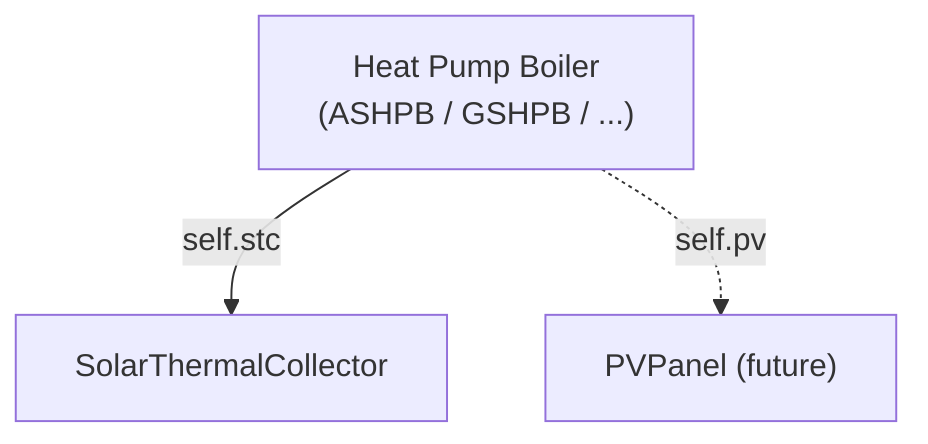

# Subsystems — Attachable Equipment Modules

> Module: `enex_analysis.subsystems`

## Overview

Provides self-contained subsystem classes that can be plugged into any heat-pump
boiler model.  Each subsystem bundles its configuration parameters with the
methods that operate on them, enabling **plug-in / plug-out composition** via
optional constructor injection.

```python
# Example: attach STC to an ASHPB
from enex_analysis.subsystems import SolarThermalCollector
from enex_analysis import AirSourceHeatPumpBoiler

stc = SolarThermalCollector(A_stc=4.0, stc_placement='tank_circuit')
hp = AirSourceHeatPumpBoiler(..., stc=stc)
```

## Architecture



### Extension Pattern

To add a new subsystem:

1. Create a `@dataclass` class in `subsystems.py` with config attributes
2. Add `calculate_dynamic()` and `assemble_results()` methods
3. Add an optional parameter to the boiler's `__init__`
4. Wire the subsystem into the simulation loop

When the file grows beyond 3 subsystems, upgrade to a package:
```
subsystems/
├── __init__.py
├── stc.py
└── pv.py
```

---

## `SolarThermalCollector`

Flat-plate or evacuated-tube solar thermal collector with two placement modes.

### Parameters

| Parameter | Default | Unit | Description |
|---|---|---|---|
| `A_stc` | 2.0 | m² | Collector gross area |
| `stc_tilt` | 35.0 | ° | Tilt from horizontal |
| `stc_azimuth` | 180.0 | ° | Azimuth (180 = south) |
| `A_stc_pipe` | 2.0 | m² | Pipe surface area |
| `alpha_stc` | 0.95 | – | Absorptivity |
| `h_o_stc` | 15.0 | W/(m²·K) | External convective coeff |
| `h_r_stc` | 2.0 | W/(m²·K) | Radiative coeff |
| `k_ins_stc` | 0.03 | W/(m·K) | Insulation conductivity |
| `x_air_stc` | 0.01 | m | Air gap thickness |
| `x_ins_stc` | 0.05 | m | Insulation thickness |
| `preheat_start_hour` | 6.0 | h | Preheat window start |
| `preheat_end_hour` | 18.0 | h | Preheat window end |
| `dV_stc_w` | 0.001 | m³/s | STC loop flow rate |
| `E_stc_pump` | 50.0 | W | STC pump rated power |
| `stc_placement` | `'tank_circuit'` | – | `'tank_circuit'` or `'mains_preheat'` |

### Placement Modes

| Mode | Description |
|---|---|
| `tank_circuit` | STC heats water circulated from/to the tank |
| `mains_preheat` | STC preheats mains water before it enters the tank |

### Methods

| Method | Description |
|---|---|
| `is_enabled` | Property: `True` when `A_stc > 0` |
| `is_preheat_on(hour)` | Check if hour falls in preheat window |
| `calculate_dynamic(...)` | Compute STC performance for one timestep |
| `assemble_results(...)` | Build STC result entries for DataFrame |

### Usage

```python
stc = SolarThermalCollector(
    A_stc=4.0,
    stc_tilt=35.0,
    stc_azimuth=180.0,
    stc_placement='tank_circuit',
    preheat_start_hour=6,
    preheat_end_hour=18,
)

# Standalone usage (one timestep):
result = stc.calculate_dynamic(
    I_DN=500.0,             # Direct-normal irradiance [W/m²]
    I_dH=100.0,             # Diffuse-horizontal [W/m²]
    T_tank_w_K=333.15,      # Tank temp [K]
    T0_K=278.15,            # Dead-state [K]
    preheat_on=True,
    dV_tank_w_in=0.001,     # Current refill flow [m³/s]
    T_tank_w_in_K=288.15,   # Mains water temp [K]
)

# Plugged into a boiler:
hp = AirSourceHeatPumpBoiler(..., stc=stc)
df = hp.analyze_dynamic(...)
```

---

## Constants

### `STC_OFF`

Default result dict returned when no STC is attached or when STC is inactive.

```python
STC_OFF = {
    'stc_active': False,
    'stc_result': {},
    'T_stc_w_out_K': np.nan,
    'T_stc_w_final_K': np.nan,
    'Q_stc_w_out': 0.0,
    'Q_stc_w_in': 0.0,
    'E_stc_pump': 0.0,
}
```

## References

- Low-level STC physics: `enex_functions.calc_stc_performance()`
- Used by: `AirSourceHeatPumpBoiler`, future `GroundSourceHeatPumpBoiler`
