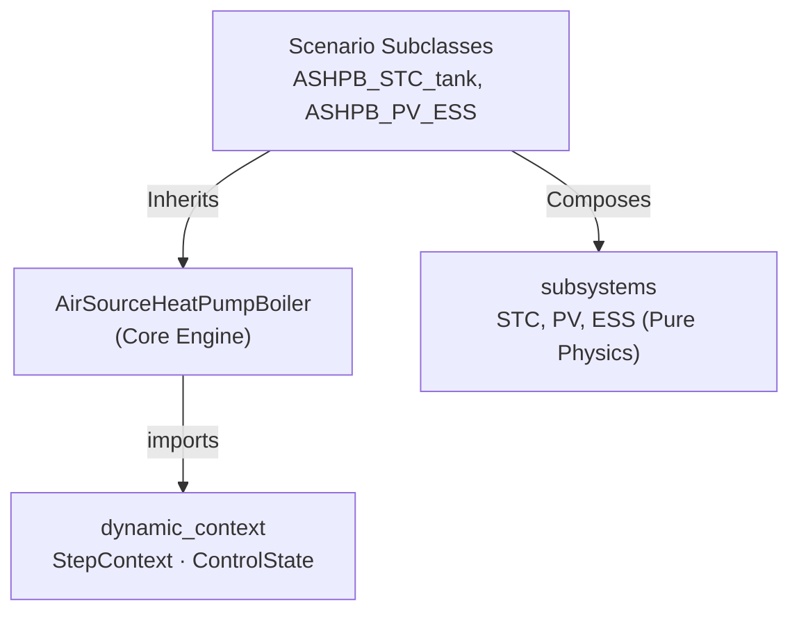
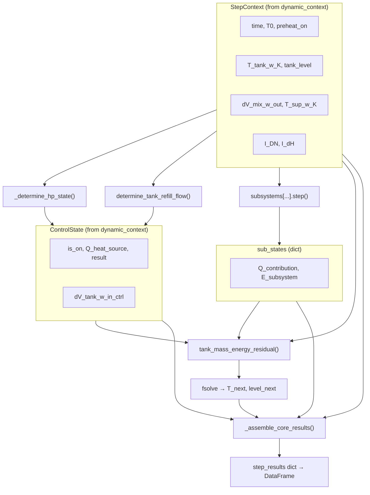

# Air Source Heat Pump Boiler (ASHPB)

> Module: `enex_analysis.AirSourceHeatPumpBoiler`

## Overview

Physics-based air source heat pump boiler model with refrigerant cycle resolution,
dynamic tank simulation, and optional subsystem integration via class-based injection.
The model finds the optimal evaporator approach temperature at each time step by
minimizing total electrical power (`E_cmp + E_ou_fan`) via Brent's bounded 1-D method
(`scipy.optimize.minimize_scalar`).

The storage tank temperature is updated using a **fully implicit** scheme
(`scipy.optimize.fsolve`), solving coupled energy and mass balance residuals
at each timestep for unconditional stability.

## System Architecture

```
                ┌─────────────────────┐
  Outdoor Air → │  Evaporator (HX)    │ ← Refrigerant
                └─────────┬───────────┘
                          │
                ┌─────────▼───────────┐
                │  Compressor (VSD)   │  ← Optimisation: dT_ref_evap
                └─────────┬───────────┘
                          │
                ┌─────────▼───────────┐
                │  Condenser (HX)     │ → Hot water to Tank
                └─────────┬───────────┘
                          │
                ┌─────────▼───────────┐
                │  Expansion Valve    │
                └─────────────────────┘

  Subsystem Integration (via Scenario Subclasses):
    ASHPB_STC_tank, ASHPB_STC_preheat → SolarThermalCollector integration
    ASHPB_PV_ESS → PhotovoltaicSystem + EnergyStorageSystem
    (UVLamp can be injected directly or via subclass)
```

## Modular Structure (Phase 3)

The model uses a **Template Method** supplemented by **composition-based** architecture:



| Module | Responsibility |
|---|---|
| `dynamic_context` | `StepContext`, `ControlState`, `SubsystemExergy`, hysteresis, tank level, residual solver |
| `subsystems` | Pure physics engines (stateless): `SolarThermalCollector`, `PhotovoltaicSystem`, `EnergyStorageSystem` |
| `AirSourceHeatPumpBoiler` | ASHP-specific cycle physics, optimisation, simulation inner loop |
| `ashpb_*.py` | Scenario subclasses that orchestrate hooks (`_run_subsystems`, `_augment_results`) to route energy flows |

### Data Flow — `analyze_dynamic` per-timestep



`SolarThermalCollector`가 mains-preheat 모드로 동작할 때 집열기 출구 온도는 항상
**가열된 저탕조 유입수 온도**인 `T_tank_w_in_heated_K`로 전달되며, 관련 문서와
코드에서는 이 이름으로 통일한다.

## Key Parameters

### Refrigerant / Cycle / Compressor

| Parameter | Default | Unit | Description |
|---|---|---|---|
| `ref` | `'R134a'` | — | Refrigerant type (CoolProp string) |
| `V_disp_cmp` | 0.0002 | m³ | Compressor displacement volume |
| `eta_cmp_isen` | 0.8 | — | Isentropic efficiency |
| `dT_superheat` | 3.0 | K | Evaporator outlet superheat |
| `dT_subcool` | 3.0 | K | Condenser outlet subcool |
| `hp_capacity` | 15000.0 | W | HP rated heating capacity |

### Heat Exchanger

| Parameter | Default | Unit | Description |
|---|---|---|---|
| `UA_cond_design` | 2000.0 | W/K | Condenser design UA |
| `UA_evap_design` | 1000.0 | W/K | Evaporator design UA |
| `A_cross_ou` | π×0.25² | m² | Outdoor unit cross-section area |

### Outdoor Unit Fan

| Parameter | Default | Unit | Description |
|---|---|---|---|
| `dV_ou_fan_a_design` | 1.5 | m³/s | Design airflow rate |
| `dP_ou_fan_design` | 90.0 | Pa | Design static pressure |
| `eta_ou_fan_design` | 0.6 | — | Design fan efficiency |

### Storage Tank / Control / Load

| Parameter | Default | Unit | Description |
|---|---|---|---|
| `r0` | 0.2 | m | Tank inner radius |
| `H` | 1.2 | m | Tank height |
| `T_tank_w_upper_bound` | 65.0 | °C | Tank upper setpoint |
| `T_tank_w_lower_bound` | 60.0 | °C | Tank lower setpoint |
| `T_mix_w_out` | 40.0 | °C | Service water delivery temperature |
| `T_sup_w` | 15.0 | °C | Default mains water supply temperature |
| `dV_mix_w_out_max` | 0.0045 | m³/s | Max service flow rate |

### Subsystems (Scenario-based injection)

While the base class supports `stc` and `pv` for backward compatibility, new developments should use the scenario subclasses:

| Scenario Class | Injected Parameters | Description |
|---|---|---|
| `ASHPB_STC_tank` | `stc: SolarThermalCollector` | STC circulated to/from the storage tank. |
| `ASHPB_STC_preheat` | `stc: SolarThermalCollector` | STC preheats incoming mains water. |
| `ASHPB_PV_ESS` | `pv: PhotovoltaicSystem, ess: EnergyStorageSystem` | HP powered by PV with Battery and Grid routing. |

## Usage

### Steady-State Analysis

```python
from enex_analysis import AirSourceHeatPumpBoiler

hp = AirSourceHeatPumpBoiler(
    ref='R134a',
    UA_cond_design=2000.0,
    UA_evap_design=1000.0,
)

result = hp.analyze_steady(
    T_tank_w=55.0,
    T0=5.0,
    Q_cond_target=5000,
)

print(f"Total power: {result['E_tot [W]']:.1f} W")
```

### Dynamic Simulation (without STC)

```python
import numpy as np

dt_s = 60
tN = len(np.arange(0, 86400, dt_s))
T0_schedule = np.full(tN, 5.0)

schedule = [("7:00", "8:00", 1.0), ("19:00", "21:00", 1.0)]

df = hp.analyze_dynamic(
    simulation_period_sec=86400,
    dt_s=dt_s,
    T_tank_w_init_C=20.0,
    dhw_usage_schedule=schedule,
    T0_schedule=T0_schedule,
)
```

### Dynamic Simulation with `T_sup_w_schedule`

```python
# Seasonal mains water temperature variation
T_sup_w_schedule = np.full(tN, 15.0)  # or load from file

df = hp.analyze_dynamic(
    ...,
    T_sup_w_schedule=T_sup_w_schedule,
)
```

### Dynamic Simulation with STC (Scenario Subclass)

```python
from enex_analysis.subsystems import SolarThermalCollector
from enex_analysis.ashpb_stc_tank import ASHPB_STC_tank

stc = SolarThermalCollector(
    A_stc=4.0,
    stc_tilt=35.0,
    stc_azimuth=180.0,
)

hp_stc = ASHPB_STC_tank(..., stc=stc)

df = hp_stc.analyze_dynamic(
    ...,
    I_DN_schedule=I_DN_array,
    I_dH_schedule=I_dH_array,
)
```

### Exergy Post-Processing

```python
df_ex = hp.postprocess_exergy(result_df)
```

## API Reference

| Method | Description |
|---|---|
| `analyze_steady(T_tank_w, T0, ...)` | Single operating point analysis |
| `analyze_dynamic(...)` | Time-stepping dynamic simulation (fully implicit) |
| `postprocess_exergy(df)` | Add exergy columns to result DataFrame |

### Internal Methods (ASHP-specific)

| Method | Description |
|---|---|
| `_calc_state(...)` | Evaluate refrigerant cycle at a given operating point |
| `_optimize_operation(...)` | Brent 1-D minimisation of `E_tot` |
| `_determine_hp_state(ctx, ...)` | HP hysteresis + cycle optimisation |
| `_print_opt_failure(...)` | Detailed optimisation failure diagnostics |
| `_assemble_core_results(...)` | Post-solve reporting dict assembly |

### Shared Functions (from `dynamic_context`)

| Function | Description |
|---|---|
| `determine_heat_source_on_off(...)` | Pure hysteresis logic |
| `determine_tank_refill_flow(...)` | Tank level management |
| `tank_mass_energy_residual(...)` | Energy/mass balance residuals for `fsolve` |

## References

- ASHRAE Standard 90.1-2022 (VSD fan power curves)
- CoolProp library for refrigerant properties
- See also: [dynamic_context guide](dynamic_context.md), [subsystems guide](subsystems.md)


## Usage Guide & Examples

# Jupyter Notebook Implementation Guide (For Cursor)

This document provides instructions and specifications for generating the `example.ipynb` notebook for this model. Since the actual notebook generation is deferred to Cursor, please follow these guidelines when constructing the `.ipynb` file.

## 1. Objective
Create an interactive Jupyter Notebook (`example.ipynb`) that demonstrates how to initialize, run, and visualize the simulation for this specific system/model using the `enex_analysis_engine`.

## 2. Notebook Structure Requirements

The `.ipynb` file should contain the following sequential sections (as Markdown and Code cells):

### 2.1. Introduction
- **Markdown Cell**: Add a title and a brief description of the model being simulated. 
- Mention the key components and inputs required.

### 2.2. Setup & Imports
- **Code Cell**: Import necessary modules from `src.enex_analysis`.
  - `DynamicContext` from `enex_analysis.dynamic_context`
  - The model class (e.g., `<ModelName>`)
  - Any utility or visualization modules (e.g., `enex_analysis.visualization` or `matplotlib.pyplot`)
  - Boundary conditions (if needed, e.g., `weather.py`, `dhw.py`)

### 2.3. Context Initialization
- **Code Cell**: Initialize the `DynamicContext`.
  - Set the simulation `time_step` (e.g., 60 seconds).
  - Load boundary conditions (Weather, DHW profiles).

### 2.4. Model Instantiation & Parameter Configuration
- **Markdown Cell**: Briefly explain the chosen parameters.
- **Code Cell**: Instantiate the model. Set typical or default parameters based on the corresponding `theory.md` document.

### 2.5. Simulation Loop
- **Code Cell**: Write a loop to run the simulation over a defined duration (e.g., 1 day or 1 week).
  - Example logic:
    ```python
    results = []
    for _ in range(simulation_steps):
        # Update context
        # Run model step
        # Store results
    ```
- Convert the stored results into a `pandas.DataFrame` for easy plotting.

### 2.6. Results & Visualization
- **Markdown Cell**: Explain what the plots will show (e.g., Temperatures over time, Power consumption, COP).
- **Code Cell**: Use `dartwork-mpl` (or standard `matplotlib`) to generate clear, high-quality plots of the simulation results. Ensure axes are labeled correctly with units.

## 3. Cursor Implementation Command
To generate the notebook, you can provide Cursor with this command:
*"Cursor, please read this `example_guide_for_cursor.md` file and the adjacent `theory.md` file. Use them to generate a complete, working `example.ipynb` in this directory based on the guidelines provided."*
