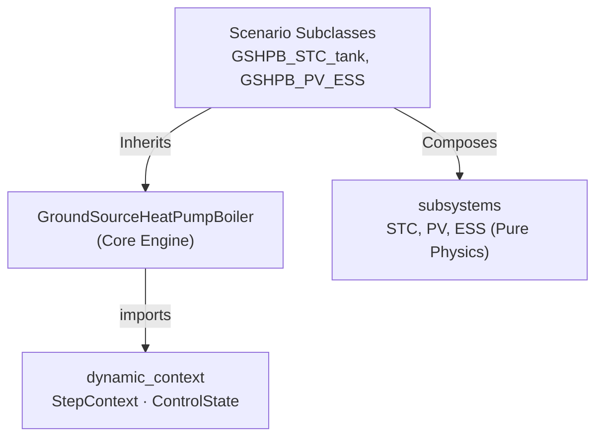

# Ground Source Heat Pump Boiler (GSHPB)

> Module: `enex_analysis.GroundSourceHeatPumpBoiler`

## Overview

Physics-based ground source heat pump boiler model with borehole heat exchanger,
refrigerant cycle resolution via CoolProp, and UV disinfection support. The
evaporator uses ground-loop water instead of outdoor air, providing stable
source temperatures year-round. The optimiser uses Differential Evolution
(SLSQP fallback) to minimise total power, and the condenser LMTD constraint
is enforced via a penalty function.

## System Architecture

```
  Ground Loop ──→ Evaporator (HX) ──→ Compressor ──→ Condenser (HX) ──→ Tank
       ↑                                                                    │
       └────────────────── Borehole Heat Exchanger ◄────────────────────────┘

  Subsystem Integration (via Scenario Subclasses):
    GSHPB_STC_tank, GSHPB_STC_preheat → SolarThermalCollector integration
    GSHPB_PV_ESS → PhotovoltaicSystem + EnergyStorageSystem
```

## Modular Structure (Phase 3)

The model uses a **Template Method** supplemented by **composition-based** architecture, matching the ASHPB implementation:



The storage tank temperature is updated using a **fully implicit** scheme (`scipy.optimize.fsolve`), solving coupled energy and mass balance residuals at each timestep.

## Key Parameters

### Refrigerant / Cycle

| Parameter | Default | Unit | Description |
|---|---|---|---|
| `refrigerant` | `'R410A'` | — | Refrigerant type |
| `V_disp_cmp` | 0.0005 | m³ | Compressor displacement |
| `eta_cmp_isen` | 0.7 | — | Isentropic efficiency |
| `dT_superheat` | 3.0 | K | Superheat |
| `dT_subcool` | 3.0 | K | Subcool |

### Ground Loop / Borehole

| Parameter | Default | Unit | Description |
|---|---|---|---|
| `T_b_f_in` | 15.0 | °C | Borehole fluid inlet temperature |
| `UA_evap_design` | 3000.0 | W/K | Evaporator design UA |

### Subsystems (Scenario-based injection)

While the base class supports `uv_lamp` features, solar integration utilizes scenario subclasses:

| Scenario Class | Injected Parameters | Description |
|---|---|---|
| `GSHPB_STC_tank` | `stc: SolarThermalCollector` | STC circulated to/from the storage tank. |
| `GSHPB_STC_preheat` | `stc: SolarThermalCollector` | STC preheats incoming mains water. |
| `GSHPB_PV_ESS` | `pv: PhotovoltaicSystem, ess: EnergyStorageSystem` | HP powered by PV with Battery and Grid routing. |

## Usage

### Steady-State Analysis

```python
from enex_analysis import GroundSourceHeatPumpBoiler

gshp = GroundSourceHeatPumpBoiler(
    refrigerant='R410A',
    V_disp_cmp=0.0005,
)

result = gshp.analyze_steady(
    T_tank_w=55.0,
    T_b_f_in=15.0,
    Q_cond_load=8000,
    T0=5.0,
)

print(f"COP: {result['cop_sys']:.2f}")
```

### Dynamic Simulation (without Subsystems)

```python
import numpy as np

dt_s = 60
tN = len(np.arange(0, 86400, dt_s))
T0_schedule = np.full(tN, 5.0)

df = gshp.analyze_dynamic(
    simulation_period_sec=86400,
    dt_s=dt_s,
    T_tank_w_init_C=20.0,
    dhw_usage_schedule=[("7:00", "8:00", 1.0)],
    T0_schedule=T0_schedule,
)
```

### Dynamic Simulation with STC (Scenario Subclass)

```python
from enex_analysis.subsystems import SolarThermalCollector
from enex_analysis.gshpb_stc_tank import GSHPB_STC_tank

stc = SolarThermalCollector(A_stc=4.0)

hp_stc = GSHPB_STC_tank(
    stc=stc, 
    refrigerant='R410A',
    hp_capacity=10000.0,
)

df = hp_stc.analyze_dynamic(
    ...,
    I_DN_schedule=I_DN_array,
    I_dH_schedule=I_dH_array,
)
```

## API Reference

| Method | Description |
|---|---|
| `analyze_steady(T_tank_w, T_b_f_in, ...)` | Single operating point analysis |
| `analyze_dynamic(...)` | Dynamic simulation with tank and BHE g-function |

### Internal Methods

| Method | Description |
|---|---|
| `_calc_state(optimization_vars, T_tank_w, Q_cond_load, T0)` | Evaluate refrigerant cycle |
| `_calc_off_state(T_tank_w, T0)` | Zero-load result dict for OFF state |
| `_optimize_operation(T_tank_w, Q_cond_load, T0)` | Differential Evolution minimisation |

## References

- CoolProp library for refrigerant properties
- Finite Line Source (FLS) g-function model


## Usage Guide & Examples

# Jupyter Notebook Implementation Guide (For Cursor)

This document provides instructions and specifications for generating the `example.ipynb` notebook for this model. Since the actual notebook generation is deferred to Cursor, please follow these guidelines when constructing the `.ipynb` file.

## 1. Objective
Create an interactive Jupyter Notebook (`example.ipynb`) that demonstrates how to initialize, run, and visualize the simulation for this specific system/model using the `enex_analysis_engine`.

## 2. Notebook Structure Requirements

The `.ipynb` file should contain the following sequential sections (as Markdown and Code cells):

### 2.1. Introduction
- **Markdown Cell**: Add a title and a brief description of the model being simulated. 
- Mention the key components and inputs required.

### 2.2. Setup & Imports
- **Code Cell**: Import necessary modules from `src.enex_analysis`.
  - `DynamicContext` from `enex_analysis.dynamic_context`
  - The model class (e.g., `<ModelName>`)
  - Any utility or visualization modules (e.g., `enex_analysis.visualization` or `matplotlib.pyplot`)
  - Boundary conditions (if needed, e.g., `weather.py`, `dhw.py`)

### 2.3. Context Initialization
- **Code Cell**: Initialize the `DynamicContext`.
  - Set the simulation `time_step` (e.g., 60 seconds).
  - Load boundary conditions (Weather, DHW profiles).

### 2.4. Model Instantiation & Parameter Configuration
- **Markdown Cell**: Briefly explain the chosen parameters.
- **Code Cell**: Instantiate the model. Set typical or default parameters based on the corresponding `theory.md` document.

### 2.5. Simulation Loop
- **Code Cell**: Write a loop to run the simulation over a defined duration (e.g., 1 day or 1 week).
  - Example logic:
    ```python
    results = []
    for _ in range(simulation_steps):
        # Update context
        # Run model step
        # Store results
    ```
- Convert the stored results into a `pandas.DataFrame` for easy plotting.

### 2.6. Results & Visualization
- **Markdown Cell**: Explain what the plots will show (e.g., Temperatures over time, Power consumption, COP).
- **Code Cell**: Use `dartwork-mpl` (or standard `matplotlib`) to generate clear, high-quality plots of the simulation results. Ensure axes are labeled correctly with units.

## 3. Cursor Implementation Command
To generate the notebook, you can provide Cursor with this command:
*"Cursor, please read this `example_guide_for_cursor.md` file and the adjacent `theory.md` file. Use them to generate a complete, working `example.ipynb` in this directory based on the guidelines provided."*


## Web Examples

# Ground Source Heat Pump Boiler

## Basic Usage

```python
from enex_analysis import GroundSourceHeatPumpBoiler, print_balance

# Initialize ground-source heat pump boiler
gshp_boiler = GroundSourceHeatPumpBoiler()

# Set ground properties
gshp_boiler.k_g = 2.0         # Ground thermal conductivity [W/mK]
gshp_boiler.c_g = 800         # Ground specific heat [J/(kgK)]
gshp_boiler.rho_g = 2000      # Ground density [kg/m³]
gshp_boiler.T_g = 11          # Undisturbed ground temperature [°C]

# Set borehole properties
gshp_boiler.H_b = 200         # Borehole height [m]
gshp_boiler.r_b = 0.08        # Borehole radius [m]
gshp_boiler.R_b = 0.108       # Borehole thermal resistance [mK/W]
gshp_boiler.dV_f = 24         # Fluid flow rate [L/min]
gshp_boiler.E_pmp = 200       # Pump power [W]

# Set operating conditions
gshp_boiler.time = 10         # Operating time [h]
gshp_boiler.T_w_tank = 60
gshp_boiler.T_w_serv = 45
gshp_boiler.T_w_sup = 10
gshp_boiler.dV_w_serv = 1.2

# Run calculation
gshp_boiler.system_update()

# Access results
print(f"Compressor power: {gshp_boiler.E_cmp:.2f} W")
print(f"Pump power: {gshp_boiler.E_pmp:.2f} W")
print(f"COP: {gshp_boiler.COP:.2f}")
print(f"Borehole heat flow: {gshp_boiler.Q_bh:.2f} W/m")
print(f"Fluid inlet temperature: {gshp_boiler.T_f_in - 273.15:.2f} °C")
print(f"Fluid outlet temperature: {gshp_boiler.T_f_out - 273.15:.2f} °C")
print(f"Exergy efficiency: {gshp_boiler.X_eff:.4f}")

# Print exergy balance
print_balance(gshp_boiler.exergy_balance)
```

## Time-Dependent Analysis

```python
import numpy as np
import matplotlib.pyplot as plt
from enex_analysis import GroundSourceHeatPumpBoiler

# Study effect of operating time on performance
times = np.array([1, 5, 10, 24, 48, 72, 168])  # hours
cops = []
fluid_temps = []

gshp_boiler = GroundSourceHeatPumpBoiler()
gshp_boiler.T_w_tank = 60
gshp_boiler.T_w_serv = 45
gshp_boiler.T_w_sup = 10
gshp_boiler.dV_w_serv = 1.2
gshp_boiler.k_g = 2.0
gshp_boiler.H_b = 200

for t in times:
    gshp_boiler.time = t
    gshp_boiler.system_update()
    cops.append(gshp_boiler.COP)
    fluid_temps.append(gshp_boiler.T_f_in - 273.15)

fig, (ax1, ax2) = plt.subplots(1, 2, figsize=(14, 5))

ax1.plot(times, cops, 'b-o', linewidth=2, markersize=8)
ax1.set_xlabel('Operating Time [h]')
ax1.set_ylabel('COP [-]')
ax1.grid(True)
ax1.set_title('COP vs Operating Time')

ax2.plot(times, fluid_temps, 'r-o', linewidth=2, markersize=8)
ax2.set_xlabel('Operating Time [h]')
ax2.set_ylabel('Fluid Inlet Temperature [°C]')
ax2.grid(True)
ax2.set_title('Fluid Temperature vs Operating Time')

plt.tight_layout()
plt.show()
```
